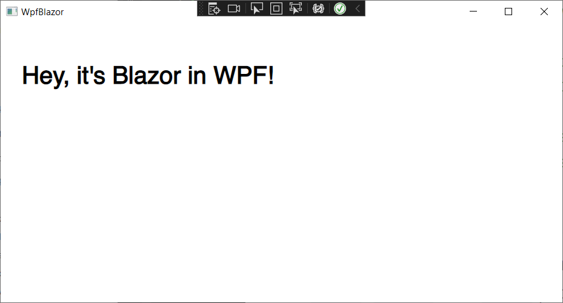

# WpfBlazor

A WPF project that hosts Blazor components.

WpfBlazor was originally built for [BlazorTrain](https://blazortrain.com/) episode 71 using Visual Studio 2022 Version 17.2.0 Preview 1.0 against .NET 6 with Microsoft.AspNetCore.Components.WebView.Wpf version 6.0.200-preview.13.2865. 

It has been updated to use .NET 7 and a non-preview version of the WebView control for WPF.

I started with the [online documentation and tutorial](https://learn.microsoft.com/en-us/aspnet/core/blazor/hybrid/tutorials/wpf?view=aspnetcore-7.0) and modified it to NOT use the `Counter` example, as I'm completely sick of it. We're going to go way beyond Counter in this tutorial.

Once I got it working, I expanded it by including the following features:

- Calling JavaScript from C#
- Calling C# from JavaScript
- Calling Razor components from WPF
- Calling Wpf Windows from Razor components
- Including third party Blazor components
- Handling Cascading Parameters
- Adding an _Imports.razor file
- Adding global using statements to App.xaml.cs

**Create a new WPF Application called WpfBlazor**

Replace *WpfBlazor.csproj* with the following:

```xml
<Project Sdk="Microsoft.NET.Sdk.Razor">

    <PropertyGroup>
        <RootNamespace>WpfBlazor</RootNamespace>
        <OutputType>WinExe</OutputType>
        <TargetFramework>net7.0-windows</TargetFramework>
        <ImplicitUsings>true</ImplicitUsings>
        <UseWPF>true</UseWPF>
    </PropertyGroup>

    <ItemGroup>
        <!--https://www.nuget.org/packages/Microsoft.AspNetCore.Components.WebView.Wpf-->
        <PackageReference Include="Microsoft.AspNetCore.Components.WebView.Wpf" Version="7.0.81" />
    </ItemGroup>
</Project>
```

We added `.Razor` to the `Sdk` attribute on line 1.

We set the `RootNamespace` property to **WpfBlazor**

We removed nullable checks.

We added the latest WebView NuGet package from here:

```
https://www.nuget.org/packages/Microsoft.AspNetCore.Components.WebView.Wpf
```

**Add a wwwroot folder**

To the *wwwroot* folder, add the following files:

*index.html*:

```html
<!DOCTYPE html>
<html lang="en">

<head>
    <meta charset="utf-8" />
    <meta name="viewport" content="width=device-width, initial-scale=1.0" />
    <title>WpfBlazor</title>
    <base href="/" />
    <link href="app.css" rel="stylesheet" />
    <link href="WpfBlazor.styles.css" rel="stylesheet" />
</head>

<body>
    <div id="app">Loading...</div>

    <div id="blazor-error-ui">
        An unhandled error has occurred.
        <a href="" class="reload">Reload</a>
        <a class="dismiss">🗙</a>
    </div>
    <script src="_framework/blazor.webview.js"></script>
</body>

</html>
```

This is essentially the boilerplate html for a Blazor WebAssembly application.

*app.css*:

```css
html, body {
    font-family: 'Helvetica Neue', Helvetica, Arial, sans-serif;
}

body {
    padding: 20px;
}

.valid.modified:not([type=checkbox]) {
    outline: 1px solid #26b050;
}

.invalid {
    outline: 1px solid red;
}

.validation-message {
    color: red;
}

#blazor-error-ui {
    background: lightyellow;
    bottom: 0;
    box-shadow: 0 -1px 2px rgba(0, 0, 0, 0.2);
    display: none;
    left: 0;
    padding: 0.6rem 1.25rem 0.7rem 1.25rem;
    position: fixed;
    width: 100%;
    z-index: 1000;
}

    #blazor-error-ui .dismiss {
        cursor: pointer;
        position: absolute;
        right: 0.75rem;
        top: 0.5rem;
    }
```

Add a new **Razor Component** to the project called *Index.razor*:

```html
@using Microsoft.AspNetCore.Components.Web

<h1>@Message</h1>
```

In order for Wpf to understand what *Index* is you need a class, so we have to add a code-behind class.

*Index.razor.cs*:

```c#
namespace WpfBlazor;

public partial class Index
{
    protected string Message { get; set; } = "Hey, it's Blazor in WPF!";
}
```

The next thing we need to do is modify *MainWindow.Xaml.cs* as follows:

```c#
using Microsoft.Extensions.DependencyInjection;
using System.Windows;

namespace WpfBlazor;

/// <summary>
/// Interaction logic for MainWindow.xaml
/// </summary>
public partial class MainWindow : Window
{
    public MainWindow()
    {
        var serviceCollection = new ServiceCollection();
        serviceCollection.AddWpfBlazorWebView();
        Resources.Add("services", serviceCollection.BuildServiceProvider());

        InitializeComponent();
    }
}
```

We've added a `serviceCollection`, which should look familiar to any ASP.NET developer.

We've added the `BlazorWebView` component to the services.

Now we can modify *MainWindow.xaml* to display the WebView as the main component:

```xaml
<Window x:Class="WpfBlazor.MainWindow"
        xmlns="http://schemas.microsoft.com/winfx/2006/xaml/presentation"
        xmlns:x="http://schemas.microsoft.com/winfx/2006/xaml"
        xmlns:d="http://schemas.microsoft.com/expression/blend/2008"
        xmlns:mc="http://schemas.openxmlformats.org/markup-compatibility/2006"
        xmlns:local="clr-namespace:WpfBlazor"
        xmlns:blazor="clr-namespace:Microsoft.AspNetCore.Components.WebView.Wpf;assembly=Microsoft.AspNetCore.Components.WebView.Wpf"
        mc:Ignorable="d"
        Title="WpfBlazor" Height="720" Width="1280" WindowStartupLocation="CenterScreen">
    <Grid>
        <blazor:BlazorWebView HostPage="wwwroot/index.html" Services="{DynamicResource services}">
            <blazor:BlazorWebView.RootComponents>
                <blazor:RootComponent Selector="#app" ComponentType="{x:Type local:Index}" />
            </blazor:BlazorWebView.RootComponents>
        </blazor:BlazorWebView>
    </Grid>
</Window>
```

We've added XAML namespaces for the local app (`local`) as well as the WebView (`blazor`), and set the `WindowStartupLocation`, `Title`, `Height`, and `Width` properties.

In the `<Grid>` control, we've added the `BlazorWebView` component as the sole child. That guarantees us it will take up the whole window space.

We've also set a single`RootComponent` pointing to the `#app` selector using *Index.razor* as the sole content. 

Run the app. It should look something like this:



### Basic Interaction

Let's program a basic button and click handler.

Add the following line to *Index.razor*:

```html
<button @onclick="ClickMe">Click Me</button>
```

And add the following handler in *Index.razor.cs*:

```c#
protected void ClickMe()
{
    Message = $"Message updated at {DateTime.Now.ToLongTimeString()}";
}
```

Run the app and click the button to test the interaction.

### Add a Child Component

Create a *Components* folder, and to it add the following:

*ChildComponent.razor*:

```html
@using Microsoft.AspNetCore.Components.Web

<div>
    @Message
</div>
```

And add the code-behind class *ChildComponent.razor.cs*:

```c#
using Microsoft.AspNetCore.Components;
namespace WpfBlazor.Components;

public partial class ChildComponent : ComponentBase
{
    protected string Message { get; set; } = string.Empty;

    protected override void OnInitialized()
    {
        Message = $"ChildComponent initialized at {DateTime.Now.ToLongTimeString()}";
    }
}
```

Replace *Index.razor* with the following:

```html
@using Microsoft.AspNetCore.Components.Web
@using WpfBlazor.Components

<h1>@Message</h1>
<button @onclick="ClickMe">Click Me</button>

<br/>
<br/>
<ChildComponent/>
```

Noticed we've added another @using statement.

Run the app. It doesn't do much yet, but we'll get there.


### Call into JavaScript

Add the following to *wwwroot/index.html* at line 22:

```html
<script>
    window.GetWindowWidth = () => {
        return window.innerWidth;
    }
</script>
```

This function will return the width of the window

Replace *Index.razor* with the following:

```html
@using Microsoft.AspNetCore.Components.Web
@using WpfBlazor.Components
@using Microsoft.JSInterop
@inject IJSRuntime JSRuntime

<h1>@Message</h1>
<button @onclick="ClickMe">Click Me</button>

<br/>
<br/>
<ChildComponent/>
```

Replace the `ClickMe` method in *Index.razor.cs* with the following:

```c#
protected async Task ClickMe()
{
    var width = await JSRuntime.InvokeAsync<int>("GetWindowWidth", null);
    Message = $"Message updated at {DateTime.Now.ToLongTimeString()} Window Width: {width}";
}
```

Run the app. Resize the window, and click the button. It should look something like this:


### Clean up @using statements

Replace *App.xaml.cs* with the following:

```c#
global using Microsoft.JSInterop;
global using Microsoft.AspNetCore.Components;
using System.Windows;

namespace WpfBlazor
{
    /// <summary>
    /// Interaction logic for App.xaml
    /// </summary>
    public partial class App : Application
    {
    }
}
```

We removed the unnecessary `using` statements add added two `global using` statements.

Now add the following Razor Component to the project:

*_Imports.razor*:

```
@using Microsoft.AspNetCore.Components.Web
@using WpfBlazor.Components
@using Microsoft.JSInterop
```

Now we can remove the @using statements from the Razor components:

*Index.razor*

```html
@inject IJSRuntime JSRuntime

<h1>@Message</h1>
<button @onclick="ClickMe">Click Me</button>

<br/>
<br/>
<ChildComponent/>
```

*ChildComponent.razor*:

```html
<div>
    @Message
</div>
```

*ChildComponent.razor.cs:*

```c#
namespace WpfBlazor.Components;

public partial class ChildComponent : ComponentBase
{
    protected string Message { get; set; } = string.Empty;

    protected override void OnInitialized()
    {
        Message = $"ChildComponent initialized at {DateTime.Now.ToLongTimeString()}";
    }
}
```

Run the app to make sure it still runs as before.

### Call C# from JavaScript

Add the following to *wwwroot/index.html* before the `</script>` tag at line 26:

```javascript
var dotNetHelper;

window.RegisterWPFApp = (dotNetRef) => {
    dotNetHelper = dotNetRef;
    window.addEventListener("resize", handleResize);
}

function handleResize() {
    dotNetHelper.invokeMethodAsync("WindowResized", window.innerWidth, window.innerHeight);
}
```

We've defined `dotNetHelper` as a global. This represents the component we're calling into.

The `RegisterWPFApp` method saves the component reference and adds the `resize` event listener, `handleResize()` which we have also provided.

`handleRezize()` will be called whenever the window resizes. It then will call the `WindowResized` C# method in our component, passing the window width and height.

Replace *Index.razor.cs* with the following:

```c#
namespace WpfBlazor;

public partial class Index
{
    protected string Message { get; set; } = "Hey, it's Blazor in WPF!";

    protected async Task ClickMe()
    {
        var width = await JSRuntime.InvokeAsync<int>("GetWindowWidth", null);
        Message = $"Message updated at {DateTime.Now.ToLongTimeString()} Window Width: {width}";
    }

    protected override async Task OnAfterRenderAsync(bool firstRender)
    {
        if (firstRender)
        {
            await JSRuntime.InvokeVoidAsync("RegisterWPFApp", DotNetObjectReference.Create(this));
        }
    }

    [JSInvokable]
    public async Task WindowResized(int Width, int Height)
    {
        Message = $"Screen Size: {Width} x {Height}";
        await InvokeAsync(StateHasChanged);
    }
}
```

Here we're overriding `OnAfterRenderAsync`. If it's the first render, we know that the JavaScript system is fully loaded, so this is the right time to call `RegisterWPFApp` passing a reference to `Index.razor`.

By using the `[JSInvokable]` attribute, and making our `WindowResized` method both `public` and `async`, it can be called from JavaScript.

> :point_up: Note that we have to call `StateHasChanged` in order to re-render the WebView. That's because the Blazor component model doesn't know that the state has changed since it originated from JavaScript.

Run the app and resize the window. Notice that as you resize, the Message


### Add BootStrap CSS files

If you simply add bootstrap css files and link them in your *wwwroot/index.html* file the app will look more like a Blazor app, and you'll be able to take advantage of Bootstrap classes.

If you don't have immediate access to bootstrap files, you can create a new Blazor WebAssembly app and copy *bootstrap.min.css* and *bootstrap.min.css.map* out of the *wwwroot/css* folder into our app's *wwwroot* folder.

Add the following to *wwwroot/index.html* before line 10:

```html
<link href="bootstrap.min.css" rel="stylesheet" />
```

Now change line 4 of *Index.razor* to the following:

```html
<button class="btn btn-primary" @onclick="ClickMe">Click Me</button>
```

Run the app.


### Access Razor Component Code from WPF Component

Yes, this is possible! However, we need to expose a reference to the Razor Component so we can make the call. 

Add the following class to the project:

*AppState.cs*:

```c#
namespace WpfBlazor;

public static class AppState
{
    public static Index IndexComponent { get; set; }
}
```

This is a static class, meaning it's a single instance that we do not need to instantiate.

Now we can set this in *Index.razor.cs*. Replace it with the following:

```c#
namespace WpfBlazor;

public partial class Index
{
    private string message = "Hey, it's Blazor in WPF!";
    public string Message
    {
        get => message;
        set
        {
            message = value;
            StateHasChanged();
        }
    }

    protected async Task ClickMe()
    {
        var width = await JSRuntime.InvokeAsync<int>("GetWindowWidth", null);
        Message = $"Message updated at {DateTime.Now.ToLongTimeString()} Window Width: {width}";
    }

    protected override void OnInitialized()
    {
        AppState.IndexComponent = this;
    }

    protected override async Task OnAfterRenderAsync(bool firstRender)
    {
        if (firstRender)
        {
            await JSRuntime.InvokeVoidAsync("RegisterWPFApp",
               DotNetObjectReference.Create(this));
        }
    }

    [JSInvokable]
    public async Task WindowResized(int Width, int Height)
    {
        Message = $"Screen Size: {Width} x {Height}";
        await InvokeAsync(StateHasChanged);
    }
}
```

When the `Index` component initializes, we set `AppState.IndexComponent` to our component instance.

We've also converted the Message field into a property with a backing field, so when it is set we can call `StateHasChanged()` to force a re-rendering.

Add a button to *MainWindow.xaml*

```xaml
<Window x:Class="WpfBlazor.MainWindow"
        xmlns="http://schemas.microsoft.com/winfx/2006/xaml/presentation"
        xmlns:x="http://schemas.microsoft.com/winfx/2006/xaml"
        xmlns:d="http://schemas.microsoft.com/expression/blend/2008"
        xmlns:mc="http://schemas.openxmlformats.org/markup-compatibility/2006"
        xmlns:local="clr-namespace:WpfBlazor"
        xmlns:blazor="clr-namespace:Microsoft.AspNetCore.Components.WebView.Wpf;assembly=Microsoft.AspNetCore.Components.WebView.Wpf"
        mc:Ignorable="d"
        Title="MainWindow" Height="720" Width="1280" WindowStartupLocation="CenterScreen">
    <Grid>
        <Grid.RowDefinitions>
            <RowDefinition Height="35" />
            <RowDefinition Height="*" />
        </Grid.RowDefinitions>
        <StackPanel Orientation="Horizontal" Grid.Row="0" Margin="20,10,0,0" >
            <Button Width="100" Click="Button_Click">WPF Button</Button>
        </StackPanel>
        <blazor:BlazorWebView     
                Grid.Row="1"
                HostPage="wwwroot/index.html" 
                Services="{DynamicResource services}">
            <blazor:BlazorWebView.RootComponents>
                <blazor:RootComponent Selector="#app" ComponentType="{x:Type local:Index}" />
            </blazor:BlazorWebView.RootComponents>
        </blazor:BlazorWebView>
    </Grid>
</Window>
```

All we did here is add another row to the grid, and in that row we placed a new button.

Add the code-behind Click handler to *MainWindow.xaml.cs* before line 19:

```c#
private void Button_Click(object sender, RoutedEventArgs e)
{
    AppState.IndexComponent.Message = $"Shared String Updated at {DateTime.Now.ToLongTimeString()}";
}
```

Run the app and click the button at the top of the window. It should look something like this:


### Consume a third-party Blazor component

We're going to add the Blazor Extensions Canvas component to the project. This gives us the ability to draw graphics to an html `<Canvas>` object using Blazor instead of JavaScript.

The repo for this component is at https://github.com/BlazorExtensions/Canvas but you can add the package via NuGet at https://www.nuget.org/packages/Blazor.Extensions.Canvas

After installing it, your *WpfBlazor.csproj* file should look like this (minus the comments):

```xml
<Project Sdk="Microsoft.NET.Sdk.Razor">

    <PropertyGroup>
        <RootNamespace>WpfBlazor</RootNamespace>
        <OutputType>WinExe</OutputType>
        <TargetFramework>net7.0-windows</TargetFramework>
        <ImplicitUsings>true</ImplicitUsings>
        <UseWPF>true</UseWPF>
    </PropertyGroup>

    <ItemGroup>
        <PackageReference Include="Blazor.Extensions.Canvas" Version="1.1.1" />
        <!--https://www.nuget.org/packages/Microsoft.AspNetCore.Components.WebView.Wpf-->
        <PackageReference Include="Microsoft.AspNetCore.Components.WebView.Wpf" Version="7.0.81" />
    </ItemGroup>
    
</Project>
```

Add the following to *wwwroot/index.html* before line 23:

```html
<script src="_content/Blazor.Extensions.Canvas/blazor.extensions.canvas.js"></script>
```

Add the following to *_imports.razor*:

```
@using Blazor.Extensions.Canvas
```

Add the following global using statements to the top of *App.xaml.cs*:

```c#
global using Blazor.Extensions;
global using Blazor.Extensions.Canvas;
global using Blazor.Extensions.Canvas.Canvas2D;
```

Add the following to *Index.razor* at line 9:

```html
<BECanvas Width="300" Height="400" @ref="_canvasReference"></BECanvas>
```

Add the following to *Index.razor.cs* before line 5:

```c#
private Canvas2DContext _context;
protected BECanvasComponent _canvasReference;
```

Change the `OnAfterRenderAsync` method to the following:

```c#
protected override async Task OnAfterRenderAsync(bool firstRender)
{
    if (firstRender)
    {
        await JSRuntime.InvokeVoidAsync("RegisterWPFApp",
           DotNetObjectReference.Create(this));
    }
    _context = await _canvasReference.CreateCanvas2DAsync();
    await _context.SetFillStyleAsync("green");

    await _context.FillRectAsync(10, 100, 100, 100);

    await _context.SetFontAsync("48px serif");
    await _context.StrokeTextAsync("Hello Blazor!!!", 10, 100);
}
```

Run the app. It should look something like this:


### Implement Cascading Parameters

In a Blazor application you can encase the `<Router>` (in App.razor) in a component and access it as a Cascading Parameter in every other component. But in WPF we don't have a router, since it's not a web app. How can we achieve this?

First, we'll add a reference to `Blazored.Modal`, an open-source component that shows modal dialogs in a Blazor app using a cascading component.

You can install it any way you usually install NuGet packages, after which your *WpfBlazor.csproj* file should look like this:

```xml
<Project Sdk="Microsoft.NET.Sdk.Razor">

    <PropertyGroup>
        <RootNamespace>WpfBlazor</RootNamespace>
        <OutputType>WinExe</OutputType>
        <TargetFramework>net7.0-windows</TargetFramework>
        <ImplicitUsings>true</ImplicitUsings>
        <UseWPF>true</UseWPF>
    </PropertyGroup>

    <ItemGroup>
        <PackageReference Include="Blazor.Extensions.Canvas" Version="1.1.1" />
        <!--https://www.nuget.org/packages/Microsoft.AspNetCore.Components.WebView.Wpf-->
        <PackageReference Include="Microsoft.AspNetCore.Components.WebView.Wpf" Version="7.0.81" />
        <PackageReference Include="Blazored.Modal" Version="7.1.0" />
    </ItemGroup>

</Project>
```

Add the following to *_Imports.razor*

```
@using Blazored.Modal
@using Blazored.Modal.Services
```

Add the following to the top of *App.xaml.cs*:

```c#
global using Blazored.Modal;
global using Blazored.Modal.Services;
```

Finally, we need to add the service in *MainWindow.xaml.cs* before line 15:

```c#
serviceCollection.AddBlazoredModal();
```

Add the following modal component to the *Components* folder:

*DisplayMessage.razor*:

```html
<div>
    <p>@Message</p>
    <button @onclick="SubmitForm" class="btn btn-primary">Submit</button>
    <button @onclick="Cancel" class="btn btn-secondary">Cancel</button>
</div>
```

And add a code-behind file:

*DisplayMessage.razor.cs*:

```c#
namespace WpfBlazor.Components;

public partial class DisplayMessage : ComponentBase
{
    [CascadingParameter]
    public BlazoredModalInstance BlazoredModal { get; set; }

    [Parameter] 
    public string Message { get; set; }

    async Task SubmitForm() => await BlazoredModal.CloseAsync();
    async Task Cancel() => await BlazoredModal.CancelAsync();
}
```

Replace *Index.razor* with the following:

```html
@inject IJSRuntime JSRuntime
@inject IModalService Modal

<CascadingBlazoredModal>
    <h1>@Message</h1>
    <button class="btn btn-primary" @onclick="ClickMe">Click Me</button>

    <br />
    <br />
    <button class="btn btn-primary" @onclick="ShowModal">Show Modal</button>

    <br/>
    <br/>
    <ChildComponent/>
    <BECanvas Width="300" Height="400" @ref="_canvasReference"></BECanvas>
</CascadingBlazoredModal>
```

This is how we can access the cascading parameter. Wrap the markup in it!

Add the following to *Index.razor.cs*:

```c#
public void ShowModal()
{
    var parameters = new ModalParameters();
    parameters.Add(nameof(DisplayMessage.Message), "Hey, WPF!");
    Modal.Show<DisplayMessage>("Passing Data", parameters);
}
```

Run the app and press the **Show Modal** button. It should look like this:


### Call WPF Code from Blazor

We've learned how to call Blazor code from a XAML interaction, now let's call C# code in a XAML code-behind from Blazor.

Add the following property to *AppState.cs*:

```c#
public static MainWindow MainWindow {get;set;}
```

Replace *MainWindow.xaml.cs* with the following:

```c#
using Microsoft.Extensions.DependencyInjection;
using System.Windows;

namespace WpfBlazor;

/// <summary>
/// Interaction logic for MainWindow.xaml
/// </summary>
public partial class MainWindow : Window
{
    public MainWindow()
    {
        var serviceCollection = new ServiceCollection();
        serviceCollection.AddWpfBlazorWebView();
        serviceCollection.AddBlazoredModal();
        Resources.Add("services", serviceCollection.BuildServiceProvider());

        InitializeComponent();
        AppState.MainWindow = this;
    }

    public void ShowMessageBox(string Message)
    {
        MessageBox.Show(Message);
    }

    private void Button_Click(object sender, RoutedEventArgs e)
    {
        AppState.IndexComponent.Message = 
            $"Shared String Updated at {DateTime.Now.ToLongTimeString()}";
    }
}
```

On line 19 we added:

```c#
AppState.MainWindow = this;
```

That shares the `MainWindow` reference where it can be accessed by Blazor

We also added a `ShowMessageBox` method that displays a WPF message box. This is what we will call from Blazor code.

Add the following to *Index.razor* before line 12:

```html
<br />
<br />
<button class="btn btn-primary" @onclick="TalkToWPF">Talk to WPF</button>
```

And finally, add this method to *Index.razor.cs*:

```c#
protected void TalkToWPF()
{
    AppState.MainWindow?.ShowMessageBox("Hey, this is Blazor Calling!");
}
```

Run the app and click the **Talk to WPF** button to see the result

## Summary

In this tutorial we created a new WPF app and implemented the `WebView` control for WPF. We added an _Imports.razor file, and we added global using statements. We called JavaScript code from C#. We called C# code from JavaScript. We accessed Razor component code from WPF. We called WPF code from Razor components. We learned how to use third-party Blazor components. Finally, we learned how to access Cascading components. 